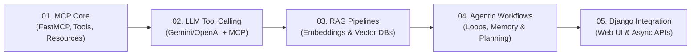

# 🚀 Agentic Stack & LLM Engineering Learning Hub

Welcome to your structured hands-on learning repository for **LLMs, Model Context Protocol (MCP), RAG, Autonomous Agents, and Django Integration**.

---

## 📍 Learning Roadmap & Stages



| Stage | Module Name | Focus Areas | Status |
| :--- | :--- | :--- | :---: |
| **01** | [`01_mcp_basics`](./01_mcp_basics/) | FastMCP / MCPServer, custom tools, resources, prompts, stdio | ✅ Complete |
| **02** | [`02_llm_tool_calling`](./02_llm_tool_calling/) | Binding MCP tools to Gemini LLM, function calling schemas, execution loop | ✅ Complete |
| **03** | [`03_rag_pipeline`](./03_rag_pipeline/) | Chunking strategies, Vector embeddings, ChromaDB, Context Retrieval | 🔄 Next Up |
| **04** | [`04_agentic_workflows`](./04_agentic_workflows/) | Agent loops, ReAct framework, multi-tool orchestration, memory state | ⏳ Upcoming |
| **05** | [`05_django_integration`](./05_django_integration/) | Connecting Agentic workflows with Django REST APIs & web dashboards | ⏳ Upcoming |

---

## 📑 Concept Notes & Journal (`/docs`)

Keep track of mental models, key insights, architectural decisions, and things to **Learn, Re-learn, and Unlearn**:

- [01 - MCP Fundamentals & Architecture](./docs/01_mcp_fundamentals.md)
- [02 - LLM Function Calling vs MCP Tools](./docs/02_llm_tool_calling_notes.md) *(coming soon)*
- [03 - Modern RAG & Context Engineering](./docs/03_rag_notes.md) *(coming soon)*
- [04 - Autonomous Agent Design Patterns](./docs/04_agentic_patterns.md) *(coming soon)*

---

## 🛠 Repository Structure

```text
.
├── README.md               <-- Main Roadmap & Progress Dashboard
├── .gitignore              <-- Git ignores (venv, env vars, etc.)
├── docs/                   <-- Detailed concept notes & journals
│   └── 01_mcp_fundamentals.md
├── 01_mcp_basics/          <-- Step 1: MCP Protocol & FastMCP Server
│   ├── server.py           <-- Basic FastMCP Server
│   └── custom_tools.py     <-- Adding Tools, Resources & Prompts
├── 02_llm_tool_calling/    <-- Step 2: Connecting LLM client with MCP
├── 03_rag_pipeline/        <-- Step 3: Embeddings, Vector Search & Retrieval
├── 04_agentic_workflows/   <-- Step 4: ReAct Agent Loops & Multi-Agent systems
└── 05_django_integration/  <-- Step 5: Full-Stack Web Integration (Django)
```

---

## 🐙 Version Control & GitHub Strategy

1. **Commit per milestone**: Keep git commits granular (e.g. `feat(mcp): add weather tool`, `docs(mcp): document transport protocols`).
2. **Branching**: Use branches for experimentations (e.g., `feature/rag-chromadb`).
3. **GitHub Remote**: Push this repository to GitHub so you can view your progress anywhere.
