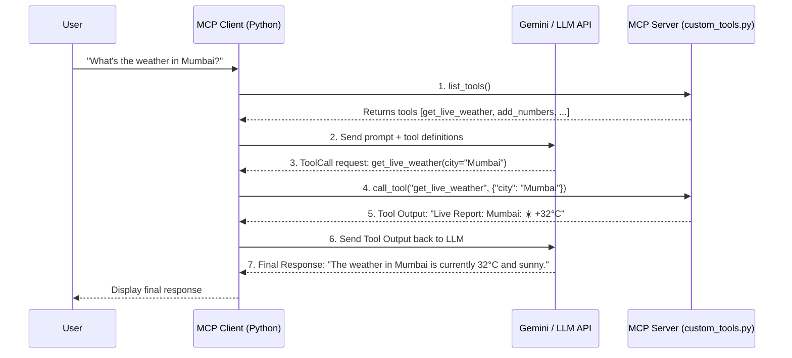

# 📗 Journal 02: LLM Tool Calling & MCP Client Architecture

## 1. What is an MCP Client?

In Stage 01, we built an **MCP Server** (`MCPServer`). 
An **MCP Client** is the program that connects to one or more MCP servers, retrieves their available tools/resources, and manages the execution loop with an LLM.

---

## 2. Key Client Primitives in Python (`mcp` SDK)

To build an MCP Client in Python, we use:

- `stdio_client(server_params)`: Spawns the MCP server Python process over stdio.
- `ClientSession(read_stream, write_stream)`: Establishes a JSON-RPC session.
- `session.initialize()`: Handshakes with the MCP server.
- `session.list_tools()`: Retrieves all registered tools and their JSON schemas.
- `session.call_tool(tool_name, arguments)`: Executes a tool on the server and returns the result.

---

## 3. Learn, Re-learn & Unlearn Log

> 💡 **Learned**: The MCP Client is the "bridge" between an LLM API and an MCP Server. The LLM never talks to the MCP Server directly—the client orchestrates the communication.
>
> 🔄 **Re-learned**: The LLM model returns a tool call request *instead* of a text message when it decides a tool is needed. The client must execute the tool and call the LLM a second time with the tool's result.
>
> ❌ **Unlearned**: You don't have to manually format JSON Schemas for tools—`session.list_tools()` returns standard tool schemas that can be converted directly for Gemini / OpenAI APIs.
