# 📗 Journal 03: RAG Pipelines & Pinecone Vector Database

## 1. What is RAG (Retrieval-Augmented Generation)?

RAG is a technique that connects an LLM to external, private, or real-time document bases without re-training or fine-tuning the model.

```mermaid
flowchart TD
    subgraph Ingestion["1. Ingestion Phase"]
        Docs["Custom Documents\n(PDF, Markdown, DB)"] --> Chunking["Text Chunking\n(Recursive Splitter)"]
        Chunking --> Embedder["Gemini Embeddings\n(text-embedding-004)"]
        Embedder --> VectorDB[("Pinecone Vector DB\n(768-dim Index)")]
    end

    subgraph Querying["2. Query Phase (MCP RAG Tool)"]
        UserQuery["User Prompt"] --> QueryEmbed["Generate Query Vector"]
        QueryEmbed --> PineconeSearch["Pinecone Vector Similarity Search"]
        PineconeSearch --> TopK["Top-k Relevant Chunks"]
        TopK --> LLMContext["Feed Chunks to LLM Context"]
        LLMContext --> FinalAnswer["LLM Answer Grounded in Fact"]
    end
```

---

## 2. Pinecone & Vector Dimensions

- **Vector Dimension**: `768` (Matches Google Gemini `text-embedding-004`).
- **Metric**: `cosine` distance.
- **Index Type**: `ServerlessSpec` (Cloud: `aws`, Region: `us-east-1`).
- **Metadata**: Each vector in Pinecone stores text content (`text`), source document name (`source`), and chunk ID (`chunk_id`).

---

## 3. Learn, Re-learn & Unlearn Log

> 💡 **Learned**: Pinecone decouples vector storage and fast similarity search from the local machine. It manages indexing, scaling, and metadata filtering in the cloud.
>
> 🔄 **Re-learned**: Embedding dimension MUST match the vector database index dimension (e.g., Gemini `text-embedding-004` produces 768 float numbers per chunk, so the Pinecone index must be created with `dimension=768`).
>
> ❌ **Unlearned**: RAG is not just dumping full raw documents into an LLM prompt. Good RAG requires smart text chunking (e.g., 500 characters with 50-character overlap) so search returns pinpoint snippets instead of noisy pages.
